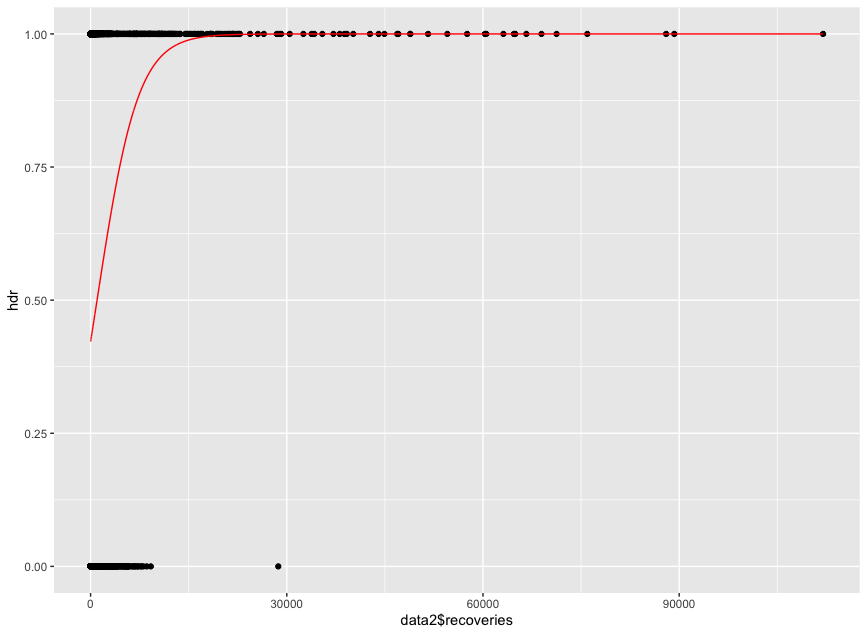
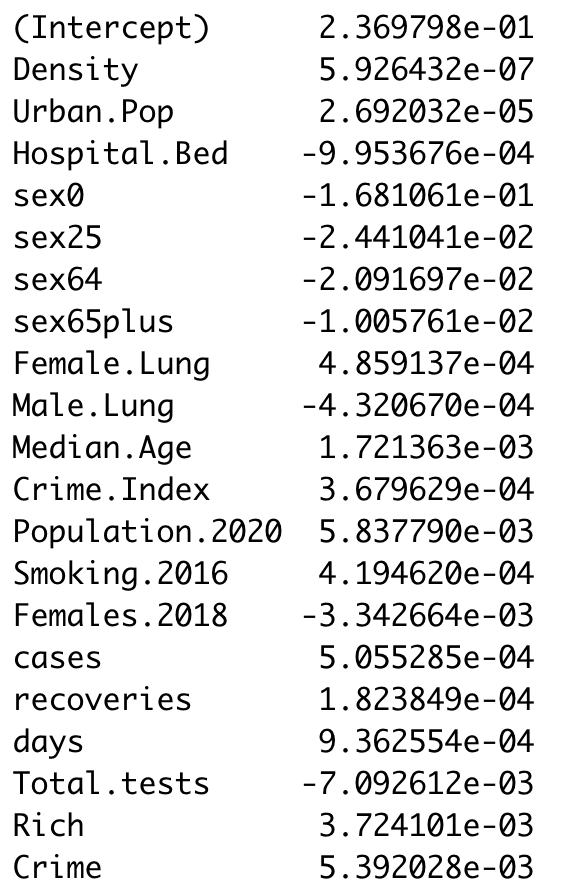
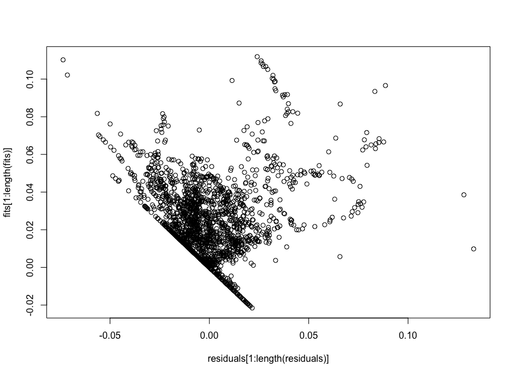
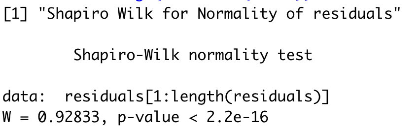
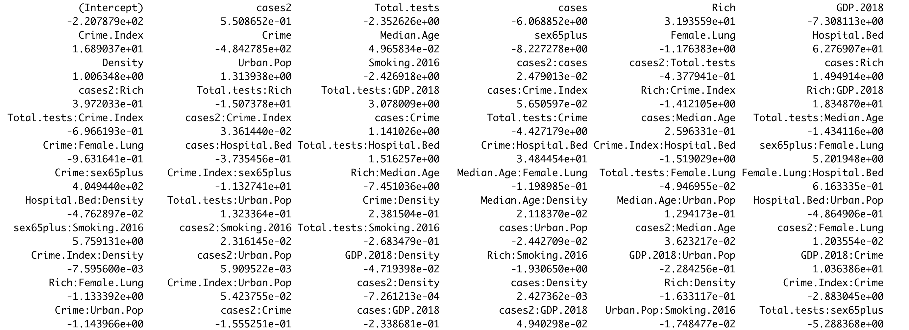
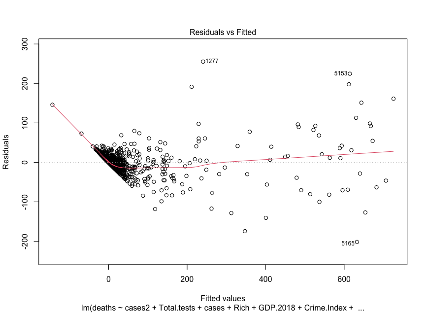
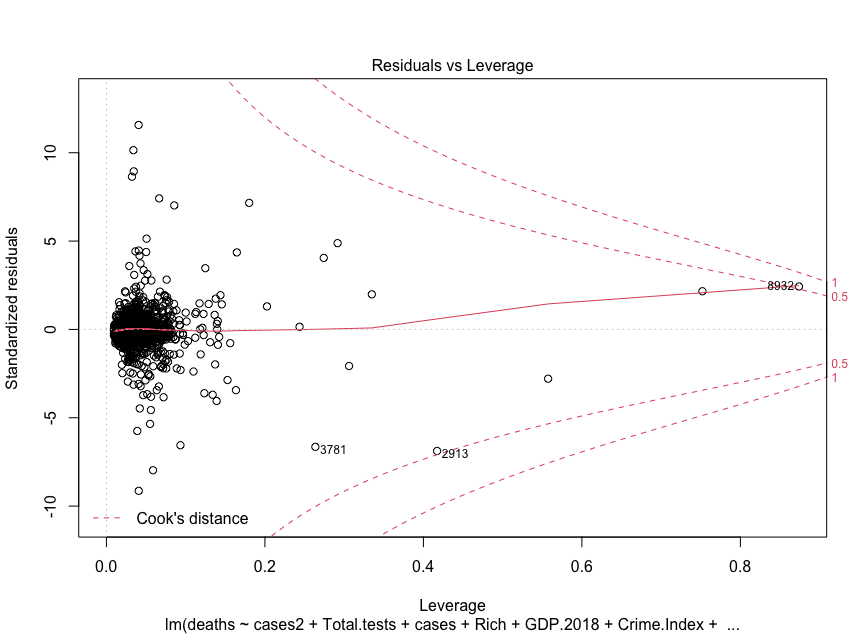

```{r setup, include=FALSE}
knitr::opts_chunk$set(echo = TRUE)
```
```{r, results=FALSE, include=FALSE}
#secret-> getting data, packages and functions, setting seed
options(warn=-1)

#PACKAGES:

#install.packages("plyr")
library(plyr)
library(npsurv)
#install.packages("fitdistrplus")
library(fitdistrplus)
#install.packages("utils")
library(utils)
#install.packages("httr")
library(httr)
#install.packages("TSstudio")
library(TSstudio)
#install.packages("tidyverse")
library(tidyverse)
# install.packages("chron")
library(chron)
#install.packages("expss")
library(expss)
#install("ggplot2")
library(ggplot2)
#install.packages("reshape2")
library(reshape2)
#install.packages("stats4")
library(stats4)
#install.packages("RColorBrewer")
library(RColorBrewer)
#install.packages("latticeExtra")
library(latticeExtra)
#install.packages("Hmisc")     
library(Hmisc)
#install.packages("sem")
library(sem)
#install.packages("rgl")
library(rgl)
#install.packages("multcomp")
library(multcomp)
#install.packages("leaps")
library(leaps)
#install.packages("aplpack")
library(aplpack)
#install.packages("Rcmdr")
library(Rcmdr)
#install.packages("MASS")
library(MASS)
#install.packages("car")
library(car)
#install.packages("quantmod")
library(quantmod)
#install.packages("nnet")
library(nnet)
#install.packages("neuralnet")
library(neuralnet)
#install.packages("glmnet")
library(glmnet)
#install.packages("miscTools")
library(miscTools)
#install.packages("sandwich")
library(sandwich)
library(actuar)

#SETTING SEED FOR CONSISTENT RESULTS
set.seed(3.141592)


#FUNCTIONS

#formatJHU:
#Formats JHU COVID 19 data so that it is formatted like
#Europa Open Data
formatJHU=function(JHUdata,title){
  JHUdata = arrange(JHUdata, Country.Region)
  
  track=1
  Temp1=subset(JHUdata,,-c(Province.State,Lat,Long))
  Temp2=subset(Temp1,,-c(Country.Region)) #using for col summing
  Temp1=Temp1[0,] #going to fill this in
  k=1
  attach(JHUdata)
  for(i in 2:nrow(JHUdata)){
    if(Country.Region[i]!=Country.Region[i-1]){
      Temp1[k,1]=Country.Region[i-1]
      Temp1[k,2:ncol(Temp1)]=colSums(Temp2[track:(i-1),])
      k=k+1
      track=i
    }
  }
  JHUdata=Temp1
  colnames(JHUdata)[1]="countriesAndTerritories"
  
  detach(JHUdata)
  
  start=as.Date(colnames(JHUdata[2]),format="X%m.%d.%y")
  latest=as.Date(colnames(JHUdata[ncol(JHUdata)]),format="X%m.%d.%y")
  seq(start:latest)
  Date=rep(seq(start,latest,by="days"),nrow(JHUdata))
  
  countries=c()
  for(i in 1:nrow(JHUdata)){
    countries=c(countries, rep(toString(JHUdata$countriesAndTerritories[i]),(ncol(JHUdata)-1)))
  }
  results=c()
  for(i in 1:nrow(JHUdata)){
    results=c(results, as.integer(JHUdata[i,2:ncol(JHUdata)]))
  }
  
  data <- data.frame(countries, results, Date)
  colnames(data)[2]=title
  colnames(data)[1]="countriesAndTerritories"
  return(data)
}

#dccum:
#determines cumulative deaths and cases for data 
#that follows a structure as in 'geographicdata'
#and data2
dccum = function(datain){
  data=datain
  N=nrow(data)
  track=data$countriesAndTerritories[N]
  dsum=0
  csum=0
  #exploiting how data is arranged by time
  for(k in 1:N){
    if(track==data$countriesAndTerritories[k]){
      dsum=dsum+geographicdata$deaths[k]
      csum=csum+geographicdata$cases[k]
    }
    else{
      track=data$countriesAndTerritories[k]
      dsum=data$deaths[k]
      csum=data$cases[k]
    }
    data$deaths2[k]=dsum
    data$cases2[k]=csum
  }
  return(data)
}

#data2Setup:
#Sets up data2 once predictors, testing and geographicdata
#combined. Also for use when reading data in as a .csv
data2Setup = function(data){
  data <- subset(data, select = -c(Tests, Test.Pop,Quarantine,Schools,Restrictions,Total.Recovered,Total.Deaths,Total.Infected,popData2018))
  
  #(lose rows with NA Values in data)
  data2=drop_na(data)
  data2$days=data2$Date-data2$Date[which.min(data2$Date)]
  
  #make population.2020 real value, not scaled down by 1000
  data2$Population.2020=data2$Population.2020*1000
  
  #Categorical Variables:
  #Rich beign 1 defined as being above mean GDP/capita. 
  #Crime being 1 defined as being above mean crime
  #index (indicates more crime)
  #(REQ: At least 2 categorical or logical columns)
  
  data2$Rich=as.numeric(data2$GDP.2018/data2$Population.2020>(mean(data2$GDP.2018/data2$Population.2020))*1+0)
  data2$Crime=as.numeric(data2$Crime.Index>(mean(data2$Crime.Index))*1+0)
  return(data2)
}

#dateCol:
#Takes a dataframe of the same format as Geographic Data and data2
#(sharing time columns) and generates a column of dates for these
dateCol = function(data){
  data$Date= as.Date(paste(data$year,data$month,data$day,sep="-"),"%Y-%m-%d")
  return(data)
}

#ChiSq:
#Returns chi squared value
ChiSq <-function(Obs,Exp){
  sum((Obs-Exp)^2/Exp)
}

#get_upper_tri:
#Get upper triangle of the correlation matrix
get_upper_tri <- function(cormat){
  cormat[lower.tri(cormat)]<- NA
  return(cormat)
}

#%.%:
#Dot product function
"%.%" <- function(x,y) sum(x*y)

#linearm:
#Performs linear regression
linearm = function(predictors,dependent){
  v1=rep(1,nrow(predictors))
  A <- cbind(v1,predictors)
  B <- t(A)%*%A; B
  P <- A%*%solve(B)%*%t(A)
  return(solve(B)%*%t(A)%*%dependent)
}

#ggbar:
#Returns a ggplot which would plot a side by side barplot
#of the 2 inputted vectors, deaths and model. X axis noted 
#as days.
ggbar = function(a,b){
  df=as.data.frame(cbind(a,b))
  df$days=seq(1:nrow(df))
  colnames(df)[1]="Real Total Deaths"
  colnames(df)[2]="Model"
  df = melt(df, id.vars=c("days"))
  
  return(ggplot(df, aes(days, value, fill=variable)) 
         + geom_bar(stat='Identity',position=position_dodge())
         +ggtitle("Modelling the time series data for total COVID-19 deaths")
         +xlab("Days since 2020-01-22")+ylab("Total COVID-19 Deaths"))
}

#dropvif1:
#For use in model building section. Takes linear model
#Finds largest vif. If greater than 10, it drops the relevant
#variable. Returns data with dropped variable
dropvif1=function(fit,train.data){
  maxvif=which.max(vif(fit))
  if(vif(fit)[[maxvif[[1]] ]]>10){
    print(paste("Dropped",colnames(train.data)[maxvif[[1]]]))
    train.data <- subset(train.data, select=-c(maxvif[[1]]))
  }
  return(train.data)
}

#normalize:
#Normalizes data for neural net models
normalize=function(x){
  return((x-min(x))/(max(x) -min(x) ))
}

#testlassoridge:
#runs diagnostics for normality of residuals and plots residual
#fitted values plots. This is for deathrate modelling.
testlassoridge=function(fits){
  residuals=train.data$deathrate-fits
  plot(fits[1:length(fits)]~residuals[1:length(residuals)])
  return(shapiro.test(residuals[1:length(residuals)]))
}

#testlassoridge1:
#runs diagnostics for normality of residuals and plots residual
#fitted values plots. This is for daily deaths modelling.
testlassoridge1=function(fits){
  residuals=train.data$deaths-fits
  plot(fits[1:length(fits)]~residuals[1:length(residuals)])
  return(shapiro.test(residuals[1:length(residuals)]))
}


data=read.csv("data.csv")
data=dateCol(data)
geographicdata=data[,which(colnames(data)=="countriesAndTerritories"):ncol(data)]
geographicdata$days=geographicdata$Date-geographicdata$Date[which.min(geographicdata$Date)]
geographicdata <- subset(geographicdata, select = -c(Entity, Code, Total.tests))
data2=data2Setup(data)
data2 <- subset(data2, select = -c(X))
```


# Abstract

The outbreak of the COVID-19 coronavirus, caused by severe acute respiratory syndrome (SARS) coronavirus 2 (SARS-CoV-2), has so far killed over 276K people and infected a confirmed 3.97M. This open-ended project was intended to explore deathtolls and deathrates, hopefully providing insight as to what affects these and what can be done to reduce this.


# Intoduction


## Data Sources

### Recovery Data
COVID-19 Recovery data was taken from John Hopkins University Center for Systems Science and Engineering^[ 
https://raw.githubusercontent.com/CSSEGISandData/COVID-19/master/csse_covid_19_data/csse_covid_19_time_series/time_series_covid19_recovered_global.csv]. This was in cumulative recovery format for each country on a date basis.

### Predictor Data
COVID-19 Predictors were taken from Kaggle^[https://www.kaggle.com/nightranger77/covid19-demographic-predictors]. Predictors extracted from this included: Density^[https://www.worldometers.info/ - Data on Density, Population, Median Age, Urban Population], Urban Population, 2020 Population, Hospital Beds/1000 citizens^[https://data.worldbank.org/indicator/SH.MED.BEDS.ZS], Sex Ratio (overall and based on age)^[https://en.wikipedia.org/wiki/List_of_countries_by_sex_ratio, https://data.worldbank.org/indicator/SP.POP.TOTL.FE.ZS], Lung diseases death rate^[https://www.worldlifeexpectancy.com/cause-of-death/lung-disease/by-country/] (overall and for both sexes), Median age, 2018 GDP^[https://data.worldbank.org/indicator/NY.GDP.MKTP.CD], Crime Index^[https://worldpopulationreview.com/countries/crime-rate-by-country/], Smoking Rate (2016)^[https://ourworldindata.org/smoking#prevalence-of-smoking-across-the-world], for as many countries as possible.

### Testing Data
COVID-19 Testing data was downloaded from ourworldindata^[https://ourworldindata.org/grapher/full-list-total-tests-for-covid-19]. This was the cumulative number of tests for each country available on a date basis.

### Case and Death Data
COVID-19 Case and Death Data was extracted from the European Centre for Disease Prevention and Control^[https://www.ecdc.europa.eu/en/publications-data/download-todays-data-geographic-distribution-covid-19-cases-worldwide]. This contained new cases and deaths each day for a large number of countries. Cumulative cases and deaths was added, as was deathrate.

### Logical Variables

Rich and Crime discrete variables were created based on the predictor data. Rich being 1 is defined as being above mean GDP/capita. Crime being 1 is defined as being above mean crime index (indicates more crime).


## Combination
All these datapoints were joined by country and by date. 2 main dataframes were created. One contained data solely on cases, recoveries, testing and deaths. The other was a combination of this and the predictor data- this was smaller however on account of not all countries having predictor data on them available.


# Topic 1: Exploration of the Distribution and Time Series change of Variables related to Death Rate from COVID-19 using probability distributions.

## Part 1: Can we model the time series data of new deaths world wide as binomial or poisson distribution?

It was theorized that the time series data of new COVID-19 deaths worldwide could be modelled as fitting a poisson or binomial distribution. This would make sense as each case could be considered a Bernoulli random variable with some probability of surviving or dying. This probability was though to be relatively constant- enough that the model should see some success.

However both models were weak. The best binomial model found was defined as: $Total Deaths= Active Cases*0.17*P(X\leq Day)$ where $X\sim Binom(k, Death Rate)$, $k$ is defined as $Active Cases/1000$ rounded to the nearest whole number, $Day$ is days since 2020-01-22, and $DeathRate$ is considered to be the mean overall total death rate. The plot of this model is shown below.
```{r, results='hide', include=FALSE}
world=geographicdata[1:max(geographicdata$days),]
world$deathrate=1

a=subset(geographicdata,geographicdata$days==1)
logic=geographicdata$days==max(geographicdata$days)&geographicdata$countriesAndTerritories%in%a$countriesAndTerritories
a=subset(geographicdata,logic)

#number of countries at days 1 and last day
nrow(a)

for(i in 1:(max(geographicdata$days))){
  index=which(geographicdata$days==i&(geographicdata$countriesAndTerritories%in%a$countriesAndTerritories))
  index2=which(geographicdata$days==i)
  
  world$Date[i]=i+min(geographicdata$Date)
  world$days[i]=i
  
  world$deathrate[i]=sum(geographicdata$deaths2[index2])/(sum(geographicdata$cases2[index2])+1*(sum(geographicdata$cases2[index2])==0))
  world$deaths2[i]=sum(geographicdata$deaths2[index])
  world$cases2[i]=sum(geographicdata$cases2[index])
  world$deaths[i]=sum(geographicdata$deaths[index])
  world$cases[i]=sum(geographicdata$cases[index])
  world$active[i]=sum(geographicdata$active[index])
}
world$days=as.numeric(world$days)

#Could we plot a binomial distribution for deaths
model=world$active*0.17*pbinom(1:nrow(world),(round(world$active/1000)),mean(world$deathrate))
```
```{r echo=FALSE}
ggbar(world$deaths2,model)
```

This is clearly an ill-fitting model, overpredicting for the first 90 days. It erroneously also a predicted a first wave of COVID-19 deaths of sorts. Whilst it might have started to fit the real data well towards the end, it was overall poor.

The Poisson model did not fare better, with near identical results. This is unsuprising as the binomial tends to the poisson in the limit of large n given many samples and provided that they are approximately independent The best model found was defined as $Total Deaths= Active Cases*0.17*P(X\leq Day)$ where $X\sim Pois(16.68705)$ and $Day$ is days since 2020-01-22. The plot of this model is shown below.
```{r, results='hide', include=FALSE}
model=world$active*0.17*ppois(1:nrow(world), 16.68705)
```
```{r echo=FALSE}
ggbar(world$deaths2,model)
```

The same conclusions as the binomial model can be drawn for the poisson model. It is overall poor.

It was concluded therefore that modelling cumulative deaths via a probability distribution is unlikely to succeeed. Potentially multivariable regression could yield better models and reveal more about what affects death tolls.


## Part 2: How is the frequency of death rates distributed: does this converge at a certain value or does it vary wildly? Can we model this via a probability distribution function?

Looking at a plot of death rates revealed seemingly low variance, with a high concentration of deathrate values towards about 2%, with positive skew.

```{r results='hide', include=FALSE}
toplot=subset(geographicdata, deaths2!=0)
p=ggplot(toplot, aes(x=deathrate))  +
  geom_histogram(aes(y=..density..), binwidth=0.01, colour="steelblue", fill="white",bins="fd") +
  ylab("Density")+xlab("Death Rate")+ggtitle("Density Histogram of death rate")
```
```{r echo=FALSE}
p
```

This suggested that a gamma distribution would be a good fit. A gamma probability density function model was developed $f_X(x) = dgamma(shape=1.06011822, rate=21.99330112)$. This was overlayed onto the histogram.

```{r echo=FALSE}
p+stat_function(fun=dgamma, args=list(shape=1.06011822, rate=21.99330112),col="red")+xlim(0,1)
```

This looked like a decent fit. However this was shown to be wrong by a chi squared test that returned a p-value of 1.651946e-37. It is thus extremely improbable that we observe a test  statistic this extreme from the relevant chi square distribution, so under the current  evidence we strongly rejected the null hypothesis that deathrates follows a gamma distribution and failed to model the distribution of death rates. This is unsuprising as the blips seen (especially between 0.25 and 0.5) imply a standard distribution like the gamma distribution will not be valid. Potentially a heavy tail distribution could be used to alleviate this.

As such, a Burr Heavy tailed distribution was fitted with $f_X(x) = dburr(shape1=2.010724,shape2=1.354063,rate=16.967252)$. 

```{r echo=FALSE}
p+stat_function(fun=dburr, args=list(shape1=2.010724,shape2=1.354063,rate=16.967252 ),col="red")+xlim(0,1)
```

Running the Two-sample Kolmogorov-Smirnov test resulted in a p-value of 0.07323082. This meant we failed to reject the null hypothesis at the 0.05 level  of significancethat the sample came from the relevant distribution. Therefore it was concluded that deathrate counts can indeed be approximated by the Burr distribution.

# Topic 2: Exploring Correlations and Independences within COVID-19 Data

## Part 1: Is there a significant difference in mean death rates between rich countries and poor countries?

Rich countries were defined as being above mean GDP/Capita, and poor as below. The mean death rates in rich and poor countries was investigated to see if the difference of 0.002490895 (rich being larger suprisingly) was significant. A t-test was first used to look at this.
```{r results='hide', include=FALSE}
rich=which(data2$Rich==1)
poor=which(data2$Rich==0)
#Using a t test

p2=ggplot(data2, aes(x=deathrate))  +
  geom_histogram(aes(y=..density..), binwidth=0.01, colour="steelblue", fill="white",bins="fd")
#We will use a two-sample t-test to check whether there is evidence against the 
#null hypothesis that the two population means are equal

deathRateDif=mean(data2$deathrate[rich])-mean(data2$deathrate[poor]); deathRateDif
#Unsurprisingly higher 

N=100000; diff=numeric(N)
for(i in 1:N){
  samp=sample(nrow(data2),sum(data2$Rich==0)) 
  drsamp=mean(data2$deathrate[samp])
  drother=mean(data2$deathrate[-samp])
  diff[i]=drsamp-drother
}

p=ggplot() + 
  aes(diff)+ 
  geom_histogram(binwidth=0.0001,bins=1000, colour=rgb(0,0.8,0.107,1), fill=rgb(0,0.62,0.107,1))+
  ylab("Count")+
  xlab("Differences in death rates between rich and poor countries")+
  ggtitle("Histogram of differences in death rates between rich and poor countries")

```
```{r echo=FALSE}
t.test(data2$deathrate[rich],data2$deathrate[poor])
```

The T test returned a p-value 0.07699, seemingly leading to the acceptance of the null hypothesis of no mean difference of death rates between rich and poor countries. However the t-test was discovered to be fundementally flawed. T-tests assume normality. COVID-19 death-rates do not follow a normal distribution.

```{r echo=FALSE}
p2+stat_function(fun=dnorm, args=list(mean=mean(data2$deathrate), sd=sd(data2$deathrate)),col="red")+xlim(0,1)
shapiro.test(data2$deathrate)
```

This is clearly shown by the plot of the overlayed normal distribution and the Shapiro-Wilk test for normality, with p-value <2.2e-16 meaning that we reject the null hypothesis of no significant difference with the normal distribution.

As such a Permutation test was to be used to test for significant mean difference between rich and poor country deathrates, with no prior assumptions needed. 

```{r echo=FALSE}
p+geom_vline(xintercept =deathRateDif,col="blue")
```

There is a 4.199958% chance of discrepency by chance (by the p-value extracted from the test). We reject the null hypothesis of no mean difference at the 0.05 level of significance. This leads to suprising conclusion that richer countries have higher COVID-19 Deathrates. This is probably because poorer countries have less testing and are therefore less able to determine who has died from COVID-19, to such a great extent. The significant difference could be promising for modelling in topic 3 later on.


## Part 2: Are crime and high death rates independent?

A new logical variable $hdr$ was defined: being 1 for countries in the upper half of death rates, and 0 for countries in the lower half. A chi-squared test on this and $Crime$ was used to investigate independence. Below is the contingency table for these variables.

{#id .class width=30% height=30%}


The chi-squared test returned a p-value so small that the computer used rounded it to 0. This meant that the null hypothosis of independence was strongly rejected. Crime and high deathrates are unsuprisingly related, crime itself being correlated with many other critical variables in a society such as wealth and how obeyant a population is, implying omitted variable bias is at play. This suggests crime will be useful in modelling in topic 3.


## Part 3: Exploring Correlation of all our data variables amongst themselves
We can carry this out using a correlation heatmap. This could provide insights to what is likely useful for modelling in topic 3.

```{r results='hide', include=FALSE}
#extract numeric columns, ensure everything is numeric
temp <- subset(data2, select = -c(Country,countriesAndTerritories, geoId, countryterritoryCode, continentExp, Date, day, month, year, Entity, Code, dateRep))
sapply(temp, is.numeric)
temp$days=as.numeric(temp$days)

cormat <- round(cor(temp),2)


# Melt the correlation matrix
upper_tri <- get_upper_tri(cormat)
melted_cormat <- melt(upper_tri, na.rm = TRUE)
```
```{r echo=FALSE}
# Heatmap
ggplot(data = melted_cormat, aes(Var2, Var1, fill = value))+
  geom_tile(color = "white")+
  scale_fill_gradient2(low = "blue", high = "red", mid = "white", 
                       midpoint = 0, limit = c(-1,1), space = "Lab", 
                       name="Pearson\nCorrelation") +
  theme_minimal()+ 
  theme(axis.text.x = element_text(angle = 90, vjust = 1, 
                                   size = 10, hjust = 1))+
  xlab("")+ylab("")+ggtitle("Correlation heatmap for COVID-19 data")+
coord_fixed()
```

Death rate is actually not strongly correlated much at all with the other predictive variables. Perhaps this indicates that deathrate is relatively constant and hard to model. This indicates challenges for topic 3. Interestingly, we dont see high degrees of similarity overall. 

# Topic 3: Modelling deathrate and deathtoll

## Modelling deathrate via logistic regression

### Part 1: univariate logistic regression

The first attempt at doing this was with a univariate logistic model using recovery data on $hdr$, to try to model high death rates.

{#id .class width=100% height=100%}


As can be clearly seen, this is not a great model, as reflected in the low McFadden Pseudo $R^2$ value of 0.07780584. A different approach will likely be needed to explain more of the variance in deathrate, hence multiple logistic regression.

### Part 2: multiple logistic regression

7 models were trained on 80% of the data, and tested on the other 20%. The best model was determined as that which had the lowest squared estimate of errors on testing data deathrate values.

To reduce spread of outliers: $GDP.2018$, $Population.2020$, $Total.tests$ were logged. $recoveries$, $cases2$ and $cases$ were squarerooted however since they had 0 values in the data.

In order to deal with multicollinearity, the following were dropped one by one from the numeric data in accordance with their variance inflation factors: $lung$, $Sex.Ratio$, $cases2$, $sex54$, $GDP.2018$, $active$, $sex14$. This led to only these variables being used in modelling: $Density$, $Urban.Pop$, $Hospital.Bed$, $sex0$, $sex25$, $sex64$, $sex65plus$, $Female.Lung$, $Median.Age$, $Crime.Index$, $Population.2020$, $Smoking.2016$, $Females.2018$, $cases$, $recoveries$, $days$, $Total.tests$, $Rich$, $Crime$.  

The first model was a logistic regression of deathrate onto all the available variables. The second model was a logistic regression model of deathrate onto the interaction terms of all the available variables to the second power. The third model was a backward/forward stepwise regression model on the first model with AIC criterion. The fourth model was a backward/forward stepwise regression model on the first model with BIC criterion. The fifth model was a lasso model of deathrate onto all the available variables. The sixth model was a ridge model of deathrate onto all the available variables. The seventh model was a neural net model with threshold 0.1 of deathrate onto all the available variables. 

Comparison on the testing data revealed the fifth model (Linear Lasso) to be best, with the lowest SSE (5.116951e-06). Overall this model had a relatively poor $R^2$ value of 0.4917774. Its adjusted $R^2$ was very close however at 0.4703785, indicating that the model did not overfit and strongly explained some of the variance. It should be noted that in diagnostics that the residuals vs fitted values plot did not look random for low fitted values, and indicated heteroskedacity. Moreover, we received p-value <2.2e-16 in the shapiro wilk test for normality meaning that we rejected the null hypothesis of no significant difference with the normal distribution, and concluded that under the current evidence, the residuals do not follow a normal distribution. These violations of the standard linear regression assumptions could have compromised the model.


{#id .class width=30% height=30%}


{#id .class width=50% height=50%}

{#id .class width=50% height=50%}

## Modelling new deaths via linear regression


9  models were trained on 80% of the data, and tested on the other 20%. The best model was determined as that which had the lowest squared estimate of errors .

To reduce spread of outliers: $GDP.2018$, $Population.2020$, $Total.tests$ were logged. $recoveries$, $cases2$ and $cases$ were squarerooted however since they had 0 values in the data.

In order to deal with multicollinearity, the following were dropped one by one from the numeric data in accordance with their variance inflation factors: $lung$, $sex54$, $Sex.Ratio$, $sex64$, $Females.2018$, $Population.2020$, $days$, $recoveries$, $Male.Lung$, $sex0$. This led to only these variables being used in modelling: $Density$, $Urban.Pop$, $Hospital.Bed$, $sex14$, $sex25$, $sex65plus$, $Female.Lung$, $Median.Age$, $GDP.2018$, $Crime.Index$, $Smoking.2016$,  $cases$, $cases2$, $Total.tests$, $Rich$, $Crime$.  

The first model was a linear regression of new deaths onto all the available variables. The second model was a forward/backward stepwise regression model on the first model with AIC criterion. The third model was a forward/backward stepwise regression model on the first model with BIC criterion The fourth model was a linear regression model of new deaths onto the interaction terms of all the available variables to the second power. The fifth model was a forward/backward stepwise regression model on the fourth model with AIC criterion. The sixth model was a forward/backward stepwise regression model on the fourth model with BIC criterion The seventh model was a lasso model of new deaths onto all the available variables. The eighth model was a ridge model of new deaths onto all the available variables. The ninth model was a neural net with threshold 0.1 of deathrate onto all the available variables. 

Comparison on the testing data revealed the fifth and sixth models to be best, with the lowest SSEs (9.527257e+00 ). Looking at the fifth model we had a strong $R^2$ of 0.9140345 and similarly strong adjusted $R^2$ of 0.8996393, indicating that the model did not overfit and strongly explained much of the variance. It should be noted however that diagnostic plots were not promising with the fitted values versus residuals plot not looking random on the left hand side (although it was well spaced as fitted values increased) and the standardized residuals not following a normal distribution. Moreover, an non constant variance test indicated heteroscedasticity, with p value <2.22e-16 and point 8932 was poor on the cook's distance plot. These violations of linear regression assumptions could compromise the model.

{#id .class width=80% height=80%}


{#id .class width=50% height=50%}
{#id .class width=50% height=50%}
{#id .class width=50% height=50%}

{#id .class width=50% height=50%}
# Evaluation and Conclusion

## Overall comment

This project hopefully shared some insight as to the distribution of COVID-19 deathrates and deathtolls, and led to some ideas of the root factors at play with the constructed models. Although deathrates frequency was succesfully modelled by a Burr distribution, probability distributions are likely not enough to successfully model and predict  deathtolls. As such regression models are likely the way to go for better modelling. This project concluded with a not so successful attempt at this with a logistic regression for deathrates, but with also a good new deaths model being developed. Indeed this new deaths model was the best overall model developed.

## Future work

The death models were plagued with diagnostic errors, implying that assumptions of standard linear regressions were being violated. It is possible to adjust the coefficents of one's model using the $sandwich$ library, such that the assumptions of standard linear regression are met. This would clearly be something wise to do for greater application of any developed model. It would also be good to do some n-fold validation to better assess predictive performance overall.

Moreover, it could be interesting to look at and evaluate each coefficient in the model, and explain this from a biological/ epidemiological perspective. This could potentially help policy-makers better deal with the current outbreak and future ones.

Furthermore, the current model could use more variables! For instance a new dummy variable could be used to indicate whether quarantine restrictions are in place. This example in particular could help determine whether restrictions are effective. Indeed this and more variables would likely let the model explain more of the variance.

Finally, building a more in depth interlinked model system could be advantageous. One could perceive modelling susceptible individuals, and from that infectious individuals and then from that recovered individuals. This 3-way system would cover the main principles of how a virus spreads, and could potentially lead to dynamic simulations and more accurate models. 


